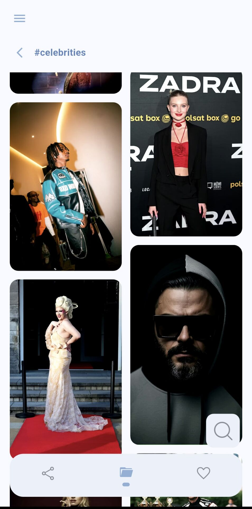
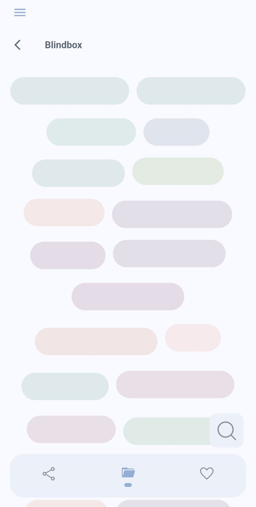
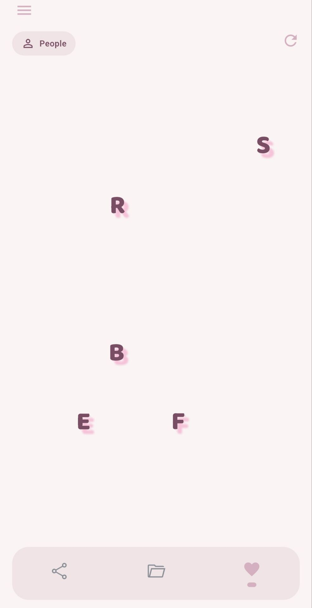

> [English](README.md) | **简体中文** | [日本語](README.ja.md)

# nook

nook 是一个面向个人收藏者的本地媒体管理工具（Android）。它通过 SMB 协议访问电脑或 NAS 上的共享文件夹，把散落其中的视频、图片和各类收藏，按照收藏者自己定义的结构组织、展示和欣赏。它本身不负责播放，点开作品后交由手机上的外部播放器（如 MX Player）打开。

「nook」意为私密而安静的一隅——如同收藏者为自己的珍藏辟出的一方角落，这正是这个项目命名的由来。

## 它要解决的问题

一个长期的收藏爱好者，手里往往攒下大量喜爱的电子收藏品：有的是视频，有的是图片，还有的是文本。它们来源各异、格式不一，堆在一起杂乱无章，既不好归类，也难以好好欣赏。现有的工具，没有一个真正合适：

- **Gallery、VLC（图片 / 视频播放器）**：只能逐个打开播放，完全谈不上「管理」。面对成百上千、类型各异的收藏，它们无能为力。

- **Solid Explorer、MT 管理器（文件管理器）**：管理文件本身是够用的，但对收藏者来说不够专业——它只认得文件和文件夹，看到的永远是一长串文件名，既不直观、也无法为收藏附加任何信息（比如这是谁、有多喜欢、什么时候收的）。整理收藏因此格外费劲，更谈不上「欣赏」。

- **Jellyfin、Fladder（媒体库 / 刮削器，Fladder 是 Jellyfin 风格的媒体库客户端）**：它们走向了另一个极端。这类工具是为电影、电视剧这样的公开影视内容设计的，依赖联网自动抓取海报、简介、演职人员等信息。对小众或个人收藏，它们既兼容不友好、又信息冗余——大多数小众作品根本不需要那么一大套元数据，而这些工具又无法按需关闭；更麻烦的是，它们会粗暴地从网络数据库拉取海报等文件塞进目录，把原本的文件夹搅得一团乱。

一边是功能太少、只能播放的播放器；一边是过于沉重、又会弄脏目录的媒体库。对一个既有收藏癖、又对整洁和秩序有要求的人来说，两头都不合适。nook 就是为了填补中间这段空白：一个集管理、展示与播放（外接播放器）于一体，干净、守规则、且只管理收藏本身的工具——它有意不去做一个管理所有文件的通用管理器。

## 设计理念

### 两种共享文件夹

nook 首先是一个能访问 SMB 共享文件夹的浏览器：在连接页填好电脑或 NAS 的地址与凭据后，就能列出其中的共享文件夹（下称 share，它是一个收藏库的根），进去浏览里面的内容。

但 nook 对待 share 有两种方式。区别在于这个 share 的根目录下有没有一个名为 `_styles.json` 的文件：

- **普通共享文件夹**（没有 `_styles.json`）：nook 不做任何假设，只能正常浏览文件夹和文件——和一个文件管理器类似。这种模式适合用来整理一个还没成形的库。
- **风格共享文件夹**（有 `_styles.json`）：nook 认为它已经是一个按规则整理过的收藏库，于是按收藏者定义的结构来组织展示。

这一判断在点开 share 时自动完成，无需手动切换。下面要展开的，正是「风格共享文件夹」内部的那套结构——它不写死在软件里，而是由文件夹的组织方式和几个约定文件决定，软件只负责读取并呈现。这套结构是作者本人整理收藏的习惯；会编程的使用者，也可以在此基础上改写代码，换成自己偏好的方式。

### 从风格开始

作者在面对一件收藏时，第一反应是按「风格」来归。所以 nook 的最顶层不是时间、不是类型，而是**风格**。

风格如何划分，全凭个人喜好——它可以很具体，也可以相当抽象。比如可以用心理学里荣格的十二人格原型来分（Innocent、Explorer……），也可以用塔罗牌的大阿卡那来分（The Fool、The Magician……）。这些分类彼此之间还可以归组，在界面上不同的组会被分隔开展示。

哪些文件夹被当作顶层风格、它们如何分组，就记录在根目录的 `_styles.json` 里：

```json
{
  "styles1": {
    "name": "Jung's Twelve Archetypes Theory",
    "styles": ["Innocent", "Explorer", "Sage"]
  },
  "styles2": {
    "name": "Tarot Major Arcana",
    "styles": ["The Fool", "The Magician"]
  }
}
```

字段名（styles1、styles2）代表分组，本身不展示，只用于在界面上分隔；每个数组里的每一项，对应根目录下一个真实存在的文件夹。只有在这里登记过的文件夹，才会作为风格出现在界面上。

### 风格之下：人物

一种风格之下，是一个个具体的对象。最常见的是「人物」——它就是风格共享文件夹里的一个子文件夹，里面直接放着这个人的作品：

```
风格共享文件夹/
└── 具体人物1/              （人物）
    ├── _cover.jpg          人物封面（可选）
    ├── _person.json         元数据（可选）
    ├── .covers/            作品封面（可选）
    ├── .gallery/           图片库（可选）
    ├── 个人vlog.mp4
    └── 旅行记录.mp4
```

人物文件夹里的 `_cover.jpg` 是这个人的封面，让浏览时一眼可辨。

### 风格之下：团体

但收藏里常常还有「团体」——一群人，他们既有各自的作品，也有共同参与的作品。nook 用一个简单的约定来区分人物和团体：一个文件夹如果**还包含子文件夹**，就当作团体，里面的子文件夹是它的成员；如果**不含子文件夹**（只有作品文件），就当作个人。

```
风格共享文件夹/
└── 集团/                   （团体：因为含有成员子文件夹）
    ├── _cover.jpg          团体封面
    ├── 集团成员1/           （成员，本身是一个人物）
    │   ├── _cover.jpg
    │   ├── _person.json
    │   └── 团体MV.mp4       团体合作的作品，实际存放在这里
    └── 集团成员2/
        ├── _cover.jpg
        └── _person.json     通过 references 指向上面那支团体MV
```

团体带来一个现实问题：一件作品（比如一支团体合作的影片）同时属于多位成员。如果为每个成员都复制一份，既浪费空间又难维护。nook 的处理是：作品实际只存放在其中一位成员名下，其他成员通过「引用」（references）指向它。这样同一件作品只有一份，却能在每位相关成员那里都被看到，而它的信息始终归属于原本存放它的那位成员。

### 作品与它们的信息

每位人物名下，是一件件作品（视频文件）。作品可以有自己的封面，存放在该人物文件夹下的 `.covers/` 里，以作品的文件名命名（如 `.covers/团体MV.mp4.jpg`）。展示一件作品时，nook 依次寻找：它在 `.covers/` 下的同名封面 → 退而用该人物的 `_cover.jpg` → 再没有就用一张占位图。这样既允许为每件作品精心准备封面，也允许偷懒。

作品的附加信息——日期、简介、喜爱程度，以及前面提到的引用关系——都记录在人物文件夹下的 `person.json` 里：

```json
{
  "name": "集团成员2", // !!! name字段实际不存在，此处标识仅作提示，文件夹名字就是实际显示的名字
  "aliases": ["另一个昵称"],
  "notes": "备注",
  "items": {
    "个人vlog.mp4": {
      "date": "2023-06-21",
      "description": "简介",
      "love": "preferred",
      "lovedAt": "2024-03-15T20:31:00.000"
    }
  },
  "references": ["风格/集团/集团成员1/团体MV.mp4"]
}
```

- `items` 的键是作品文件名，记录该作品的日期、简介和喜爱程度。
- `love`（喜爱程度）分三档：默认（不写入）、`preferred`（喜欢）、`pinnacle`（至爱）。这三档不只是标签——在「Keep」页里，所有标为喜欢或至爱的作品会被单独汇集，供收藏者随时快速回到自己最珍视的那些，而不必在整个库里翻找。
- `lovedAt` 是该作品被标记为喜爱的时间，由软件自动写入，无需手动编辑；「Keep」页可据此按收藏时间回顾。
- `references` 中每一项是一件作品的绝对路径，从风格那一层写起（不含 share 名），用于把其他人物名下的作品引用到当前人物。

喜爱程度、简介、日期都可以直接在手机上点开作品后修改，改动会立即写回 `_person.json`；更复杂的设置（比如跨成员的引用关系）则在电脑上手动编辑文件完成。所有这些都是对真实文件的直接改动，没有导入导出，也没有独立数据库——收藏的数据始终和收藏待在一起，离开 nook 也依然完整可读。

### 按需，而非强制

上面这些约定文件（`_person.json`、`_cover.jpg`、`.covers/` 等）全都是可选的。nook 默认直接展示文件夹和文件本来的样子，不要求事先准备任何配置；只有当收藏者想为某件作品设置封面、标记喜爱、写下简介时，才会在对应位置生成相应的文件。这种克制，正是为了避免落入刮削器那种把目录塞满冗余文件的境地。值得一提的是`.covers/` 文件夹不会被系统误判为团体中的人物

也因此，收藏库的根目录除了风格文件夹，还有几个以 `_` 开头的特殊区域（以 `_` 或 `.` 开头的文件夹不会被当作风格内容展示）：

```
风格共享文件夹/
├── _styles.json      风格登记表
├── _inbox/           暂存区：尚未归类的内容临时存放处（可选）
├── _blindbox/        盲盒：不讲究结构，所有内容平铺展示，随手翻看（可选）
├── Style1/           风格文件夹1（可选）
├── Style2/           风格文件夹2（可选）
└── ...
```

其中**盲盒**用来存放那些一时不想整理、或并不那么喜爱却又不舍得删的东西；**暂存区**用于临时堆放还没归类的内容。

```
具体人物/
├── _cover.jpg          人物封面（可选）
├── _person.json         元数据（可选）
├── .covers/            作品封面（可选）
├── .gallery/           图片库（可选）
├── 个人vlog.mp4
└── 旅行记录.mp4
```

而每位人物文件夹下的 `.gallery/` 则是这个人物的**图片库**，收藏里并非只有视频，图片以及各类杂项收藏都可以放在这里——图片在专门的图库界面浏览，其他文件可切换到普通模式查看。

最后，nook 的所有操作只有移动和重命名，**绝不删除任何文件**——这是对收藏者最基本的安全承诺。

### 界面一览

**人物 —— 作品 —— 作品详情**

<p align="center">
  
  
  
</p>

**登录 —— 盲盒 —— 喜爱（人物模式）**

<p align="center">
  
  
  
</p>

## License

本项目以 [GNU General Public License v3.0](LICENSE) 授权。

## 开发环境与构建（从源码运行）

普通使用直接安装发布的 APK 即可，无需编译。以下面向希望从源码运行或修改的开发者。

环境（Windows，无需 Android Studio）：

- Git
- OpenJDK
- Flutter SDK（stable）
- Android SDK 命令行工具（platform 与 build-tools）

配置好后，`flutter doctor` 中的 Flutter 与 Android toolchain 两项应为可用状态。

在手机上调试运行：

1. 手机开启开发者选项与 USB 调试，用数据线连接电脑。
2. 在项目根目录执行：

   ```
   flutter pub get
   flutter run
   ```

3. 按需修改代码
4. 打包 APK：

   ```
   flutter build apk --release
   ```

生成的文件位于 `build/app/outputs/flutter-apk/app-release.apk`。
